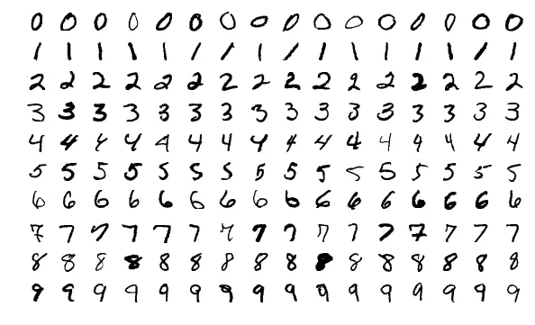
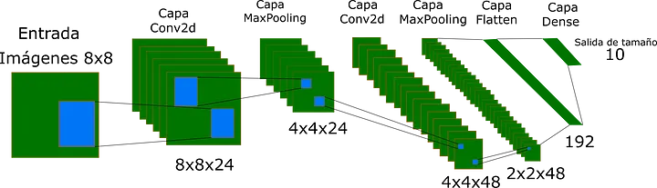

---
# ENGLISH

# 🧠 Digit Classifier with CNN
Project implementing a convolutional neural network (CNN) in TensorFlow/Keras to classify digit images (scikit-learn's load_digits dataset) and recognize hand-drawn digits from external images.



## 📌 Features
- Training on the load_digits dataset (8×8 px, grayscale).
- Preprocessing of external images:
    - Reading and normalization to scale 0–16.
    - Centered square cropping.
    - Rescaling to 8×8 px.
- Evaluation with metrics: Accuracy, Precision, Recall, F1-score, and Confusion Matrix.
- Visualization of each stage for interpretability.
- Batch classification of multiple files, showing predictions in console and graphically.

## 📂 File Structure
```
│-- main.py              # Main script with training, evaluation, and functions
│-- digito*.jpg          # Test images
│-- requirements.txt     # Dependencies
│-- README.md            # This document
```
## 🛠 Requirements
- Python 3.8+
- TensorFlow
- scikit-learn
- numpy
- matplotlib
- seaborn
- Pillow
- scikit-image

Install dependencies:

bash
```
pip install -r requirements.txt
```

## 🚀 Usage
Clone the repository and enter the project folder:

bash
```
git clone git@github.com:selvcebo/image-classifier.git

```
Place your .jpg images in the project folder.

Run:

bash
```
python main.py
```
## The script:
- Trains the model using layers.
- Shows metrics and confusion matrix.
- Processes your external images and predicts their digits.



## 🧩 External Classification Pipeline
- leer_digito(): Converts image to grayscale (0–16) and binarizes (<=7 → 0, >7 → 16).
- recortar_cuadrado(): Crops the centered digit based on pixels > 0.
- reescalar_8x8(): Reduces to 8×8 px keeping the 0–16 scale.
- predecir_digito(): Adjusts the image to shape (1, 8, 8, 1) and returns the most probable digit.

## 📊 Example Output
```
Accuracy: 0.987
Precision: 0.987
Recall: 0.987
F1: 0.987

Predictions for loaded images:
digito_felipe.jpg: 3
digito_laura.jpg: 8
...
```
(Also includes step-by-step visualizations and confusion matrix.)

## 💡 Notes
You can save and load the model with model.save() and load_model() to avoid retraining each time.

Avoid using images that are too small or noisy: cropping and binarization work best with clear contrast.

Adjust epochs and batch_size according to the performance you want.

## 📜 License
Distributed under the MIT license. If you reuse this code, give it a star ⭐ on GitHub.

---

## ✨ Author
Sergio Esteban León Valencia | Fullstack Developer | AI & Machine Learning Enthusiast

---
# ESPAÑOL

# 🧠 Clasificador de Dígitos con CNN
Proyecto que implementa una red neuronal convolucional (CNN) en TensorFlow/Keras para clasificar imágenes de dígitos (dataset load_digits de scikit-learn) y reconocer dígitos dibujados a mano a partir de imágenes externas.


## 📌 Características
- Entrenamiento sobre el dataset load_digits (8×8 px, escala de grises).
- Preprocesamiento de imágenes externas:
- Lectura y normalización a escala 0–16.
- Cuadrado y recorte centrado.
- Reescalado a 8×8 px.
- Evaluación con métricas: Accuracy, Precision, Recall, F1-score y Matriz de confusión.
- Visualización de cada etapa para interpretabilidad.
-Clasificación de varios archivos en lote, mostrando predicciones en consola y gráficamente.

## 📂 Estructura de Archivos
```
│-- main.py              # Script principal con entrenamiento, evaluación y funciones
│-- digito*.jpg          # Imágenes de prueba
│-- requirements.txt     # Dependencias
│-- README.md            # Este documento
```
## 🛠 Requisitos
- Python 3.8+
- TensorFlow
- scikit-learn
- numpy
- matplotlib
- seaborn
- Pillow
- scikit-image

Instalar dependencias:

bash
```
pip install -r requirements.txt
```

## 🚀 Ejecución
Clonar el repositorio y entrar a la carpeta del proyecto:

bash
```
git clone git@github.com:selvcebo/image-classifier.git

```
Colocar tus imágenes .jpg en la carpeta del proyecto.

Ejecutar:

bash
```
python main.py
```
## El script:
- Entrena el modelo mediante capas.
- Muestra métricas y matriz de confusión.
- Procesa tus imágenes externas y predice sus dígitos.


## 🧩 Pipeline de Clasificación Externa
- leer_digito() Convierte imagen a escala de grises (0–16) y binariza (<=7 → 0, >7 → 16).
- recortar_cuadrado() Recorta el dígito centrado según píxeles > 0.
- reescalar_8x8() Reduce a 8×8 px manteniendo la escala 0–16.
- predecir_digito() Ajusta la imagen al shape (1, 8, 8, 1) y devuelve el dígito más probable.

## 📊 Ejemplo de Salida
```
Accuracy: 0.987
Precision: 0.987
Recall: 0.987
F1: 0.987

Predicciones para las imágenes cargadas:
digito_felipe.jpg: 3
digito_laura.jpg: 8
...
```
(Incluye también visualizaciones paso a paso y matriz de confusión.)

## 💡 Notas
Puedes guardar y cargar el modelo con model.save() y load_model() para no reentrenar cada vez.

Evita usar imágenes demasiado pequeñas o con mucho ruido: el recorte y la binarización funcionan mejor con contraste claro.

Ajusta epochs y batch_size según el rendimiento que busques.

## 📜 Licencia
Distribuido bajo licencia MIT. Si reutilizas este código, dale una estrella ⭐ en GitHub.


---

## ✨ Autor
Sergio Esteban León Valencia | Desarrollador Fullstack | Entusiasta de IA y Machine Learning 
